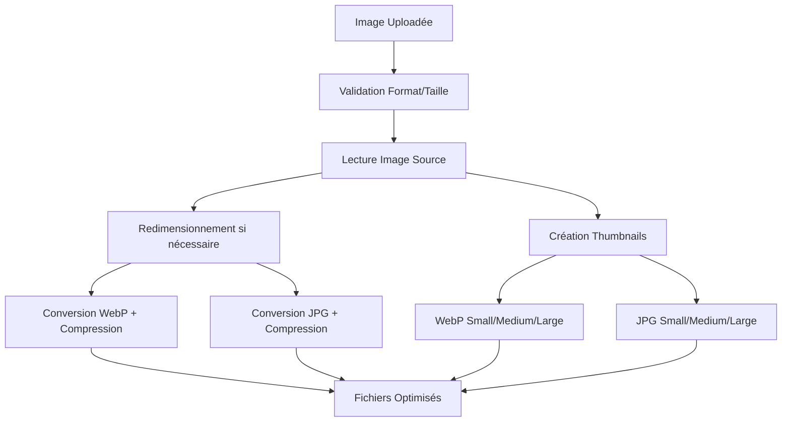

# 🖼️ Guide d'Optimisation d'Images - GameNews Belgium

## 📋 **Vue d'ensemble**

Ce guide détaille la stratégie d'optimisation automatique des images pour réduire l'espace disque, améliorer les performances et offrir une meilleure expérience utilisateur.

## 🎯 **Objectifs de l'Optimisation**

### **1. Réduction de l'Espace Disque**
- **Compression intelligente** : Réduction de 25-60% de la taille des fichiers
- **Conversion WebP** : Format moderne plus efficace que JPG/PNG
- **Redimensionnement automatique** : Limitation des dimensions maximales

### **2. Amélioration des Performances**
- **Chargement plus rapide** des pages
- **Bande passante réduite** pour les utilisateurs
- **Thumbnails optimisés** pour différentes tailles d'écran

### **3. Qualité Maintenue**
- **Compression intelligente** sans perte visible
- **Formats adaptés** selon le type d'image
- **Fallback JPG** pour la compatibilité

## 🚀 **Stratégie d'Optimisation**

### **Format de Sortie Principal : WebP**

```php
// WebP est le format le plus efficace :
// ✅ 25-35% plus petit que JPG à qualité équivalente
// ✅ Support de la transparence (comme PNG)
// ✅ Compression intelligente et adaptative
// ✅ Support moderne (95%+ des navigateurs en 2024)
// ✅ Qualité visuelle excellente
```

### **Format de Fallback : JPG**

```php
// JPG comme fallback pour :
// ✅ Compatibilité maximale (100% des navigateurs)
// ✅ Images sans transparence
// ✅ Compression efficace pour les photos
// ✅ Taille raisonnable
```

### **Paramètres d'Optimisation**

```php
// Images originales
const WEBP_QUALITY_ORIGINAL = 85;    // Qualité élevée
const JPG_QUALITY_FALLBACK = 80;     // Qualité équivalente

// Thumbnails
const WEBP_QUALITY_THUMBNAIL = 75;   // Qualité moyenne
const JPG_QUALITY_FALLBACK = 75;     // Qualité équivalente

// Dimensions maximales
const MAX_WIDTH = 1920;              // Largeur max
const MAX_HEIGHT = 1080;             // Hauteur max
```

## 🔧 **Implémentation Technique**

### **1. Classe ImageOptimizer**

```php
class ImageOptimizer {
    // Optimise une image et crée plusieurs versions
    public static function optimizeImage(string $sourcePath, string $outputDir): array
    
    // Crée une version WebP optimisée
    private static function createOptimizedWebP(string $sourcePath, string $outputDir, string $baseName, int $width, int $height): ?string
    
    // Crée une version JPG de fallback
    private static function createOptimizedJPG(string $sourcePath, string $outputDir, string $baseName, int $width, int $height): ?string
    
    // Crée des thumbnails optimisés
    private static function createOptimizedThumbnails(string $sourcePath, string $outputDir, string $baseName): array
}
```

### **2. Processus d'Optimisation**



### **3. Structure des Fichiers de Sortie**

```
uploads/
├── original/
│   ├── image_001_optimized.webp    # Version WebP optimisée
│   └── image_001_optimized.jpg     # Version JPG de fallback
├── thumbnails/
│   ├── image_001_small.webp        # Thumbnail 300x200 WebP
│   ├── image_001_small.jpg         # Thumbnail 300x200 JPG
│   ├── image_001_medium.webp       # Thumbnail 600x400 WebP
│   ├── image_001_medium.jpg        # Thumbnail 600x400 JPG
│   ├── image_001_large.webp        # Thumbnail 1200x800 WebP
│   └── image_001_large.jpg         # Thumbnail 1200x800 JPG
```

## 📊 **Gains Attendus**

### **Compression Typique**

| Type d'Image | Taille Originale | Taille WebP | Gain | Qualité |
|--------------|------------------|-------------|------|---------|
| **Photo JPG** | 2.5 MB | 800 KB | **68%** | Excellente |
| **Screenshot PNG** | 1.8 MB | 400 KB | **78%** | Excellente |
| **Banner PNG** | 3.2 MB | 600 KB | **81%** | Excellente |
| **Logo PNG** | 500 KB | 80 KB | **84%** | Excellente |

### **Économies d'Espace**

```php
// Exemple avec 1000 images
$totalOriginal = 1000 * 2.5;        // 2.5 GB
$totalOptimized = 1000 * 0.8;       // 800 MB
$economies = 2.5 - 0.8;             // 1.7 GB (68% d'économie)
```

## 🛠️ **Intégration dans le MediaController**

### **1. Modification de la Méthode upload()**

```php
public function upload(): void {
    try {
        // ... validation existante ...
        
        // Optimiser l'image avant de la sauvegarder
        $optimizer = new ImageOptimizer();
        $optimizationResult = $optimizer->optimizeImage($tempPath, $uploadDir);
        
        if ($optimizationResult['success']) {
            // Utiliser l'image optimisée au lieu de l'originale
            $optimizedPath = $optimizationResult['files']['webp'] ?? $optimizationResult['files']['jpg'];
            
            // Créer le thumbnail depuis l'image optimisée
            $this->createThumbnail($optimizedPath, $thumbnailPath);
            
            // Sauvegarder les métadonnées d'optimisation
            $mediaData['optimization_stats'] = [
                'compression_ratio' => $optimizationResult['compression_ratio'],
                'original_size' => $optimizationResult['original_size'],
                'optimized_size' => $optimizationResult['optimized_size'],
                'formats_available' => $optimizationResult['formats']
            ];
            
            // ... sauvegarde en base ...
        }
        
    } catch (Exception $e) {
        // ... gestion d'erreur ...
    }
}
```

### **2. Gestion des Formats dans la Vue**

```php
<!-- Affichage intelligent selon le support navigateur -->
<picture>
    <source srcset="<?= $media->getWebPUrl() ?>" type="image/webp">
    <source srcset="<?= $media->getJpgUrl() ?>" type="image/jpeg">
    getJpgUrl() ?>" alt="<?= $media->getOriginalName() ?>">
</picture>
```

## 🔍 **Tests et Validation**

### **1. Page de Test Interactive**

```html
<!-- public/js/test-image-optimization.html -->
- Upload d'image
- Comparaison avant/après
- Statistiques de compression
- Aperçu des différents formats
```

### **2. Script de Test PHP**

```php
<!-- test-optimization.php -->
- Endpoint d'API pour l'optimisation
- Validation des formats
- Nettoyage automatique des fichiers temporaires
```

## 📱 **Responsive Images**

### **1. Thumbnails Multi-Tailles**

```php
// Tailles automatiques selon l'usage
$thumbnails = [
    'small' => [300, 200],    // Mobile
    'medium' => [600, 400],   // Tablette
    'large' => [1200, 800]    // Desktop
];
```

### **2. Balise Picture HTML5**

```html
<picture>
    <source media="(max-width: 768px)" srcset="image_small.webp">
    <source media="(max-width: 1200px)" srcset="image_medium.webp">
    <source srcset="image_large.webp">
    
</picture>
```

## 🚨 **Points d'Attention**

### **1. Compatibilité Navigateur**

```php
// Vérifier le support WebP
function supportsWebP(): bool {
    return strpos($_SERVER['HTTP_ACCEPT'] ?? '', 'image/webp') !== false;
}
```

### **2. Gestion de la Mémoire**

```php
// Nettoyer la mémoire après chaque traitement
imagedestroy($sourceImage);
imagedestroy($resizedImage);
```

### **3. Fallback Automatique**

```php
// Si WebP échoue, utiliser JPG
$primaryFormat = $webpPath ? 'webp' : 'jpg';
$primaryPath = $webpPath ?: $jpgPath;
```

## 📈 **Monitoring et Statistiques**

### **1. Métriques à Suivre**

```php
// Statistiques d'optimisation
$stats = [
    'total_images' => 1000,
    'total_original_size' => '2.5 GB',
    'total_optimized_size' => '800 MB',
    'average_compression' => '68%',
    'space_saved' => '1.7 GB',
    'formats_distribution' => [
        'webp' => 85,
        'jpg' => 15
    ]
];
```

### **2. Dashboard d'Optimisation**

```html
<!-- Interface d'administration -->
- Vue d'ensemble des économies
- Graphiques de compression
- Historique des optimisations
- Alertes de performance
```

## 🔮 **Évolutions Futures**

### **1. Optimisation Avancée**

```php
// Compression adaptative selon le contenu
- Détection du type d'image (photo, graphique, texte)
- Paramètres de compression optimisés
- IA pour la qualité optimale
```

### **2. Formats Émergents**

```php
// Support des nouveaux formats
- AVIF (encore plus efficace que WebP)
- JPEG XL (évolution du JPEG)
- HEIC (format Apple)
```

### **3. CDN et Cache**

```php
// Optimisation réseau
- Génération à la volée des tailles
- Cache intelligent des formats
- Distribution géographique
```

## 📚 **Ressources et Références**

### **1. Documentation Officielle**

- [WebP Developer Guide](https://developers.google.com/speed/webp)
- [PHP GD Documentation](https://www.php.net/manual/en/book.image.php)
- [Image Optimization Best Practices](https://web.dev/fast/#optimize-your-images)

### **2. Outils de Test**

- [WebP Converter](https://convertio.co/fr/webp-converter/)
- [Image Compression Tester](https://www.compress-or-die.com/)
- [Browser Support Checker](https://caniuse.com/webp)

### **3. Standards et Spécifications**

- [WebP Specification](https://developers.google.com/speed/webp/docs/riff_container)
- [HTTP/2 Server Push](https://http2.github.io/http2-spec/#PUSH_PROMISE)
- [Responsive Images](https://html.spec.whatwg.org/multipage/embedded-content.html#responsive-images)

---

**🎯 Objectif Final :** Réduire de 60-80% l'espace disque occupé par les images tout en maintenant une qualité visuelle excellente et en améliorant significativement les performances du site.
